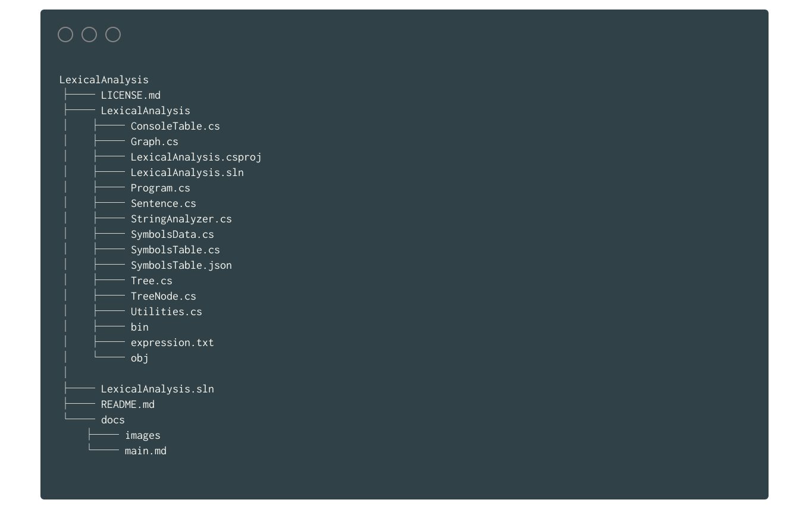
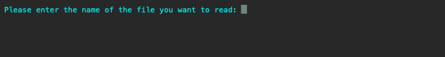
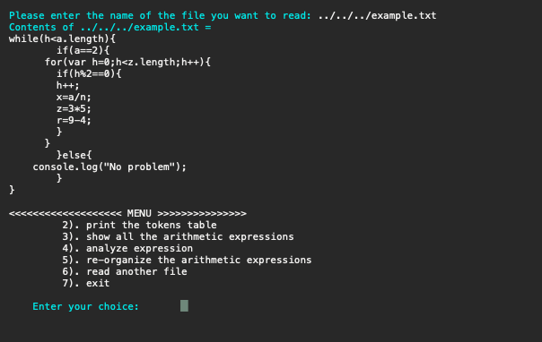
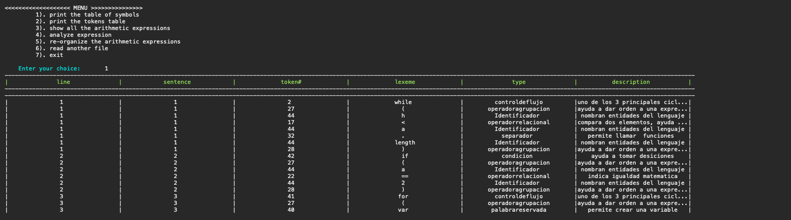
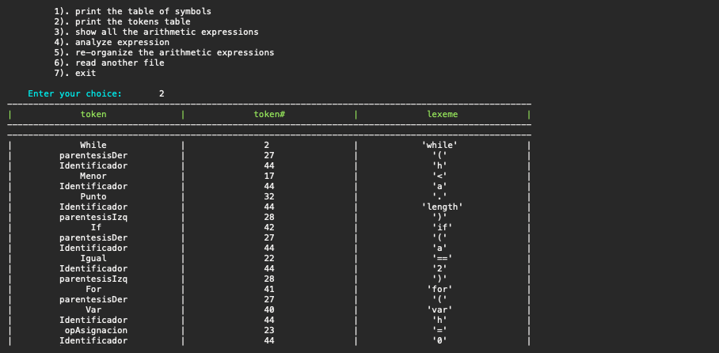
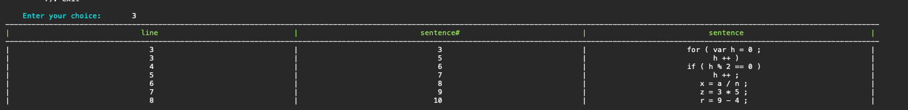

## Introducción
_"La idea detrás de los computadores digitales puede explicarse diciendo que estas máquinas están destinadas a llevar a cabo cualquier operación que pueda ser realizado por un equipo humano."_

-- Alan Mathison Turing.

Con el avance de la tecnología la vida del ser humano se ha vuelto más fácil. El impacto que esta ha traido, se puede encontrar en infinidad de campos, que van de los videojuegos hasta la medicina. Cabe adicionar, que estos grandes avances no se hubieran podido llevar acabo si todavía se programará en lenguaje maquina. De allí, la gran importancia del ingeniero en aprender él como se realizan estos procesos de traducción de lenguaje fuente a lenguaje maquina. Es por eso, que se realiza este proyecto que busca desarollar un _Analizador Léxico Gráfico_ como metodo de aprendizaje practico.

	Palabras Clave:  Compiladores, Análisis Léxico Gráfico, Automata.

## Vista General del Proyecto


La estructura general del proyecto se muestra en la Figura 1; En donde, la carpeta ***LexicalAnalysis*** es la raiz y contiene todo el proyecto. En esta podemos ver un archivo ***README.md*** que muestra las instrucciones básicas para correr el programa, también podemos encontrar el archivo ***LICENSE.md*** que muestra la licencia del programa. Otro archivo que vemos es ***LexicalAnalysis.sln*** que es generado por Visual Studio.


Figura 1. Estructura general del proyecto.

En la carpeta ***docs*** podemos encontrar todas los archivos en formato _Markdown_ que sirven para la generación de este documento. tambien se encuentra un carpeta llamada ***images*** la cual contiene todas las imagenes necesarias para hacer este documento.

si vamos a la caperta ***LexicalAnalysis > > LexicalAnalysis***  podemos ver el proyecto de C# en donde la clase principal de programa se encuentra en el archivo ***Program.cs***. hay otras dos carpetas importantes en estas carpetas son ***bin*** y ***objs*** las cuales son creadas a la hora de compilar el programa.


## Proceso de Ejecución del Pograma

Cuando ejecutamos el programa, se iniciará generando un respuesta prompt la cual pregunta por cual archivo se quiere leer como se puede ver en la Figura 2. hay que recordar que la dirección que se debe dar, debe ser relativa a la carpeta ***bin*** debido que allí se encuentra nuestro ejecutable.


Figura 2. Respuesta prompt Inicial de programa.

Si hay un problema cerciorarse que el archivo ***SymbolsTable.json*** se encuentre  bien refereciando en el metodo principal que se encuentra ***Program.cs*** como se puede ver en el codigo siguiente.

```Csharp
public static void Main()
        {
            String Json = System.IO.File.ReadAllText("../../../SymbolsTable.json");
            ...

        }
```

el proyecto incluye un archivo ejemplo llamado ***example.txt***, el cual se puede utilizarse si se desea como lo ilustra la Figura 3.


Figura 3. Ejemplo de como utilizar el archivo  *example.txt*.

Despues de presionar la tecla ENTER, el archivo imprimirá el contenido de archivo que se eligio anteriormente y proseguirá a imprimir el un menu en donde se puede elegir que proceso se desea hacer.

si se eligio la opción 1, el algoritmo proseguira ha mostrar la tabla de tokens en donde  se  muestra todos los elementos del código definido como se puede ver en la Figura 4.


Figura 4. Ejemplo del resultado entregado cuando se escoge la opcion 1.

En la opción 2, se imprimira en pantalla la tabla de los token y lexema generador correspondiente como se muestra en la Figura 5.


Figura 5. Ejemplo de la salida de tabla de tokens.


En la Figura 7 se puede apreciar la tabla de todas la expresiones algebraicas que se encontraron en el archivo leido por el programa.


Figura 6. Tabla de de expresiones algebraicas del archivo example.txt.


Por último si se desea en cualquier momento se puede cambiar el archivo que se esta analizando, Eleguiendo la opcion 7.

## Resultados y Conclusiones

* Tuve dificultades al separar las sentecias debido a que el parentesis no se si es un separador de sentencias.